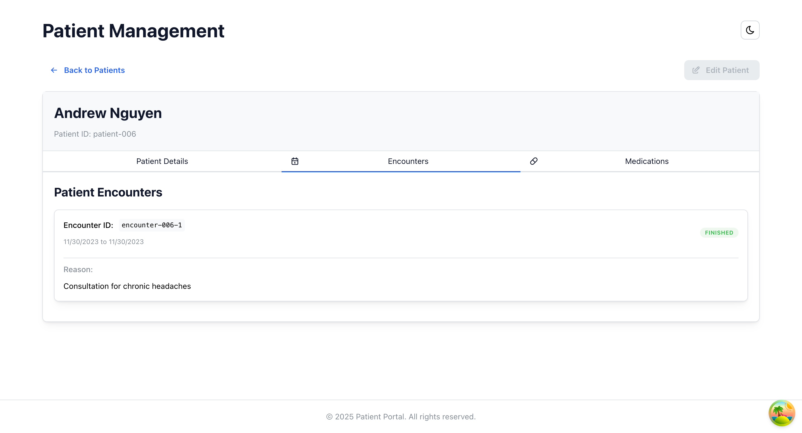

## Application Views

The following tables showcase the different views of the application in both light and dark modes:

### Patient List View

| Light Mode | Dark Mode |
|------------|-----------|
|  |  |

### Patient Details - Details View

| Light Mode | Dark Mode |
|------------|-----------|
|  |  |

### Patient Details - Encounters View

| Light Mode | Dark Mode |
|------------|-----------|
|  |  |

### Patient Details - Medications View

| Light Mode | Dark Mode |
|------------|-----------|
|  |  |

# Ascertain Code Challenge

This repository contains Ascertain's technical assessment.

## Project Structure

- `/frontend` - React client application
- `/backend` - FastAPI server application

## Getting Started

You have two options for setting up this project:

### Option 1: Individual Setup

Each component has its own detailed setup instructions:

- See [`frontend/README.md`](frontend/README.md) for React application setup
- See [`backend/README.md`](backend/README.md) for FastAPI service setup

These files contain specific requirements, available scripts, and component-specific documentation.

### Option 2: Docker Setup

```bash
docker-compose up -d
```

This will start both frontend and backend services:

- Frontend: <http://localhost:3000>
- Backend: <http://localhost:8000>
- API Documentation: <http://localhost:8000/docs>

## Technology Stack

### Frontend

- React 19 with TypeScript
- Mantine UI and Tailwind CSS

### Backend

- FastAPI (Python)
- FHIR healthcare data structure
