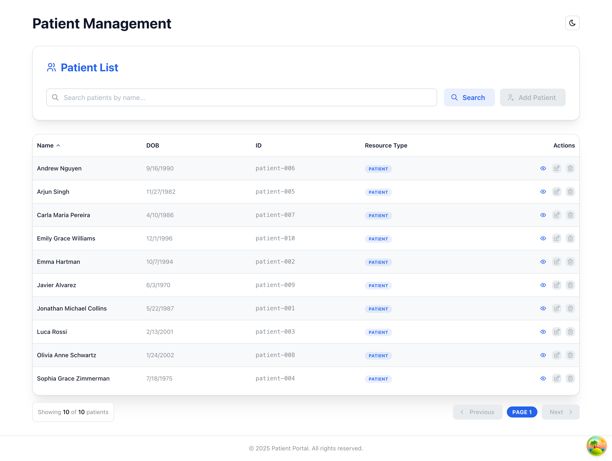
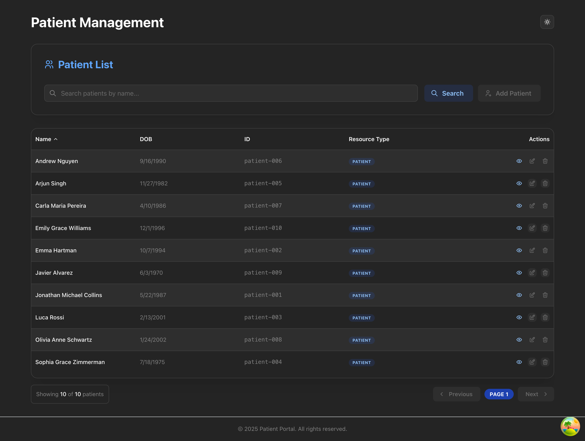
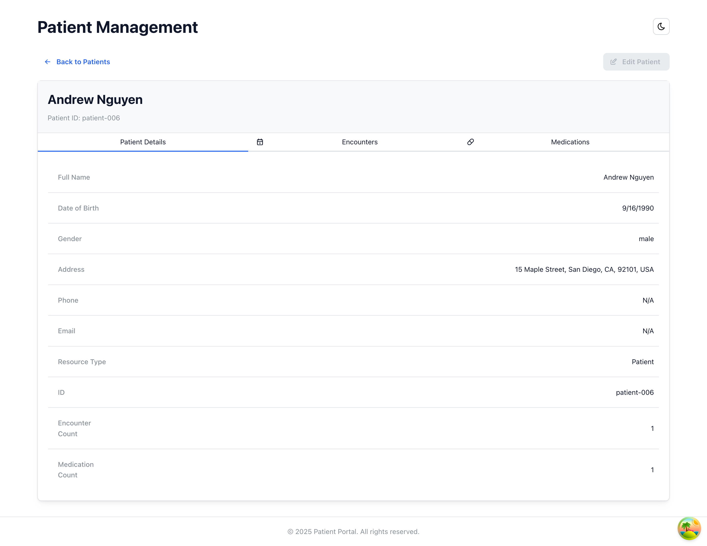
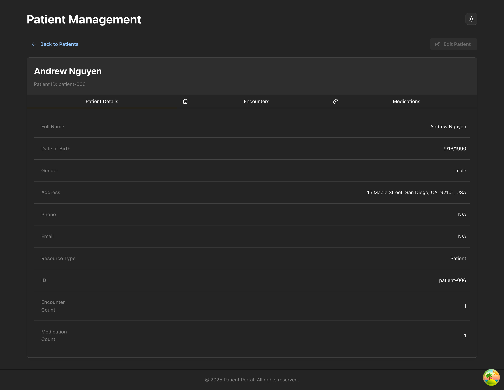
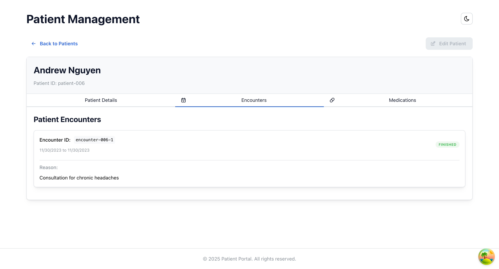
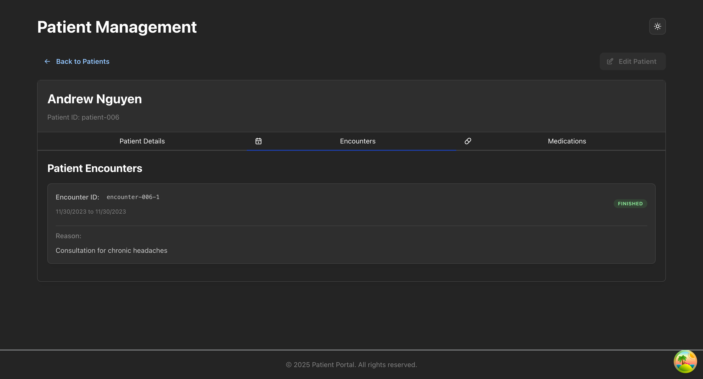
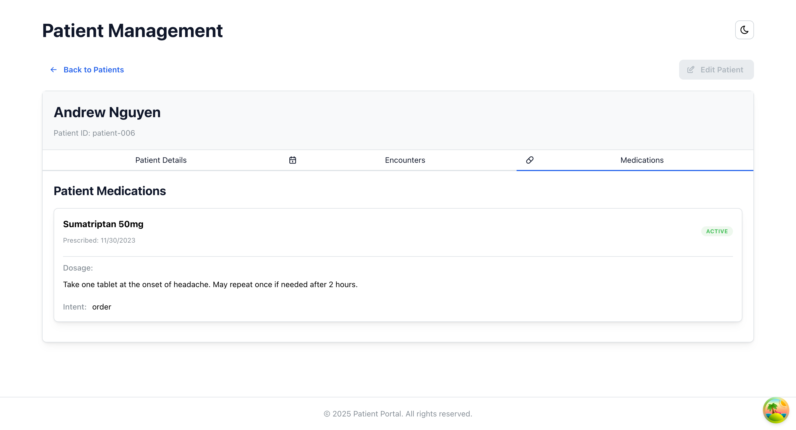
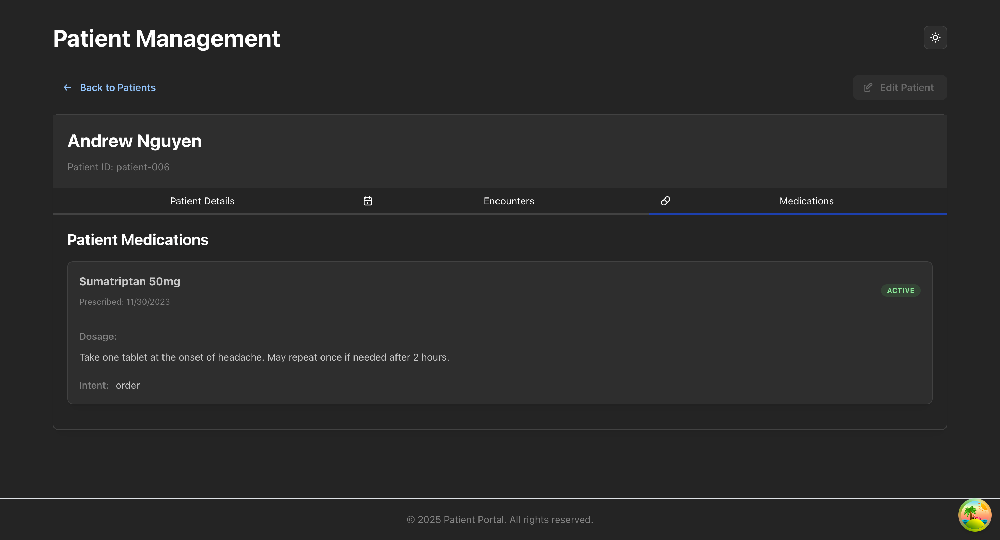

## Application Views

The following tables showcase the different views of the application in both light and dark modes:

### Patient List View

| Light Mode | Dark Mode |
|------------|-----------|
|  |  |

### Patient Details - Details View

| Light Mode | Dark Mode |
|------------|-----------|
|  |  |

### Patient Details - Encounters View

| Light Mode | Dark Mode |
|------------|-----------|
|  |  |

### Patient Details - Medications View

| Light Mode | Dark Mode |
|------------|-----------|
|  |  |

# Ascertain Code Challenge

This repository contains Ascertain's technical assessment.

## Project Structure

```text
├── backend/                   # FastAPI server application
│   ├── data/                  # FHIR data files
│   │   ├── documents/         # Medical documents (SOAP notes)
│   │   ├── encounters.json    # Patient encounters
│   │   ├── medication_requests.json # Medication requests
│   │   └── patients.json      # Patient records
│   ├── utils/                 # Utility functions
│   ├── main.py                # FastAPI application
│   └── README.md
├── frontend/                  # React client application
│   ├── src/
│   │   ├── components/       # Reusable components
│   │   │   ├── layout/       # Layout components
│   │   │   ├── patients/     # Patient-specific components
│   │   │   └── ui/           # General UI components
│   │   ├── views/            # Page-level components
│   │   │   └── patients/     # Patient views & tests
│   │   ├── queries/          # API queries and data fetching
│   │   ├── providers/        # React context providers
│   │   ├── styles/           # Global styles
│   │   └── test/             # Test utilities
│   ├── public/               # Static assets
│   └── README.md
├── docker-compose.yml         # Docker orchestration
└── README.md
```

The frontend follows a clean, modular architecture that separates:

- **Views**: Page-level components (like PatientList, PatientDetails)
- **Components**: Reusable UI components organized by feature
- **Queries**: Data fetching and API interaction logic
- **Providers**: React context and global state management

## Getting Started

You have two options for setting up this project:

### Option 1: Individual Setup

Each component has its own detailed setup instructions:

- See [`frontend/README.md`](frontend/README.md) for React application setup
- See [`backend/README.md`](backend/README.md) for FastAPI service setup

These files contain specific requirements, available scripts, and component-specific documentation.

### Option 2: Docker Setup

```bash
docker-compose up -d
```

This will start both frontend and backend services:

- Frontend: <http://localhost:3000>
- Backend: <http://localhost:8000>
- API Documentation: <http://localhost:8000/docs>

## Technology Stack

### Frontend

- React 19 with TypeScript
- Mantine UI and Tailwind CSS

### Backend

- FastAPI (Python)
- FHIR healthcare data structure
